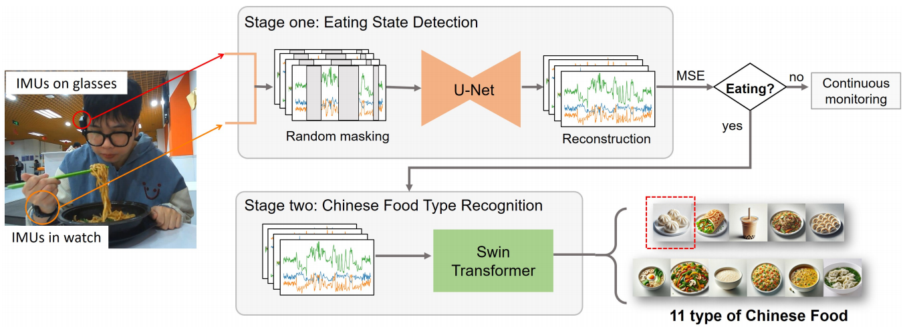

# CuisineSense

**CuisineSense** is a two-stage multimodal system designed to detect eating states and classify fine-grained Chinese food types 
using wearable Inertial Measurement Units (IMUs). By integrating hand motion cues from a smartwatch and head dynamics from smart
glasses, CuisineSense bridges the gap in wearable dietary monitoring by addressing the challenge of distinguishing the vast
diversity of Chinese cuisine.
<div align="center">
  
  <p><i>Figure 1: The CuisineSense Pipeline</i></p>
</div>

This repository contains the official implementation of the paper: 
"What's on your plate? Inferring Chinese Cuisine Intake from Wearable IMUs".

📥Dataset Download Link: 
https://www.kaggle.com/datasets/yinjiaxi/original-food-intake-data

## 🛠️ Installation

The code is tested with **Python 3.8** and **PyTorch 2.0.1**.
To set up the environment and install all dependencies, please run:

```bash
# 1. Create a conda environment (Recommended)
conda create -n cuisinesense python=3.8
conda activate cuisinesense

# 2. Install dependencies
pip install -r requirements.txt
```

## 🏃 Running the Code
